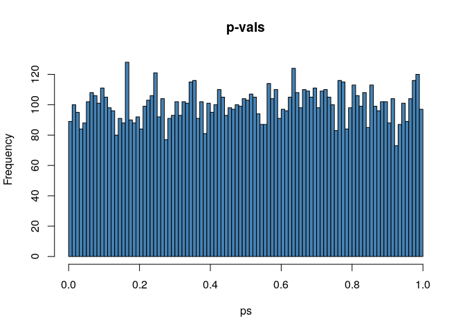
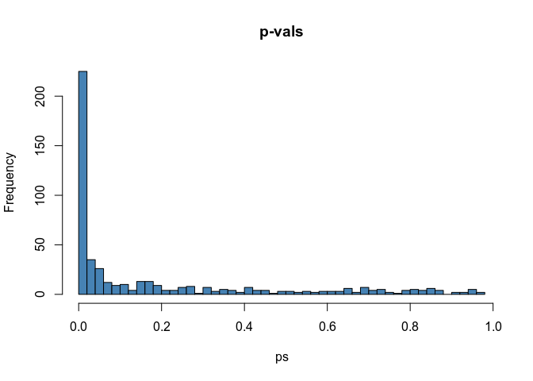

Clustering
================
Pietro Franceschi
January 28, 2018

# Multiple testing

As we discussed, we call “statistical testing” the framework that allows
us to measure the confidence of some hypothesis we are making on the
data. As always we would like to be able to derive general conclusions
of **scientific** value, but unfortunately we are observing only a
subset of the population, and it can be that strange7interesting
phenomena happens only by chance.

## Random differences

Let’s consider a comparison of 10 vs 10 samples extracted from the same
population

``` r
a <- rnorm(10)
b <- rnorm(10)

## my t-test
myttest <- t.test(a,b)
myttest$p.value
```

    ## [1] 0.9791881

If I run the previous chunk several times, you will see that the number
is changing and, if you are sufficiently patient, eventually you will
find what you would identify as a significant difference

Now, if you are measuring several properties on the same set of samples
(protein concentration, metabolite levels, bacterial abundances), you
are in substance running “in parallel” a battery of tests, so it is
obvious that you could find low p-values only by chance. This phenomenon
is called **multiple testing issue**

``` r
## 10000 tests (measuring 10000 metabolites)

ps <- rep(0,10000)
for(i in 1:10000){
  a <- rnorm(10)
  b <- rnorm(10)
  ## my t-test
  myttest <- t.test(a,b)
  ps[i] <- myttest$p.value

}

ps[1:30]
```

    ##  [1] 0.523793608 0.040459053 0.519340913 0.106100026 0.585897599
    ##  [6] 0.423907153 0.638942229 0.450015719 0.518147015 0.476853760
    ## [11] 0.377074987 0.671888227 0.576742179 0.617614321 0.961478609
    ## [16] 0.091014450 0.928583466 0.769863497 0.866625480 0.269362293
    ## [21] 0.004464419 0.574804779 0.319884508 0.501566557 0.518329626
    ## [26] 0.958520845 0.340021827 0.418546507 0.751110885 0.702805542

and ow let’s look to the distribution of p-values

``` r
hist(ps, col = "steelblue", main = "p-vals", breaks = 100)
```

<!-- -->

  - we have always low p-values
  - we have “true” differences by chance
  - we cannot conclude that the two groups are different\!

## Real Dataset

The dataset contains the results of a metabolomics investigation which
was looking to the differences between yellow and red raspberries.

``` r
load("rubusFilledSmall.RData")

## size of the dataset
dim(rubusFilledSmall)
```

    ## [1]  26 501

``` r
## top rows
rubusFilledSmall[1:10,1:10]
```

    ##    color 59/895.6  59/2153.3 73/296.2 74/1500.7 75/1314.7 81/1125.4
    ## 1      R 554.2641  163.45149 16.88382  55.67644  52.42341  46.23204
    ## 2      R 583.8497   65.78673 17.03050  27.59365  66.67933  36.56292
    ## 3      Y 715.3637  244.73819 11.30439  73.76608 145.59693  13.29055
    ## 4      Y 738.7447 1244.42081 27.08052 520.70191 245.40687  23.59776
    ## 5      Y 736.0212  217.79101 45.53661  64.84362 106.93336  23.81244
    ## 6      Y 741.8574  303.25117 30.74472  69.27449 146.94080  52.99212
    ## 7      Y 530.0425  133.97387 15.91168  37.03955 100.54183  38.30678
    ## 8      R 773.5761  103.84248 60.13555  29.86966  77.55700  81.89960
    ## 9      Y 506.1077  146.04530 40.47430 556.00434  61.75744  43.03189
    ## 10     Y 853.8415  264.73382 13.02422  55.21269  79.10691  35.44572
    ##    83/1512.1 85/1039.8 85/1512.2
    ## 1   77.97971  389.6646 106.38902
    ## 2   28.82865  350.9486  34.24567
    ## 3  163.01265  248.3759 288.65769
    ## 4  426.52676  523.5076 874.51400
    ## 5   78.57312  350.9420 102.00617
    ## 6  126.72269  599.4254 120.37431
    ## 7   82.43728  419.4075 142.30679
    ## 8   66.99827  519.2816 143.99404
    ## 9  103.34010  227.8060 156.39064
    ## 10  26.49105  307.2668  52.98210

Now we run the same t-test on all the 500 “metabolites” and we look to
the shape of the distribution of p-values

``` r
ps <- rep(0,500)
for(i in 1:500){
  ## my t-test
  myttest <- t.test(rubusFilledSmall[rubusFilledSmall$color=="R",i+1],
                    rubusFilledSmall[rubusFilledSmall$color=="Y",i+1])
  ps[i] <- myttest$p.value

}

ps[1:30]
```

    ##  [1] 2.865205e-02 1.074899e-01 1.255297e-01 6.177553e-02 1.687573e-02
    ##  [6] 4.748649e-02 4.744860e-02 1.485125e-01 1.442177e-01 2.227424e-01
    ## [11] 5.560549e-01 7.437534e-01 3.474773e-02 2.354094e-01 3.044018e-01
    ## [16] 5.736351e-02 6.156580e-01 3.159733e-03 1.173985e-01 7.102584e-01
    ## [21] 2.680573e-01 9.337783e-04 4.477403e-02 3.070773e-02 4.914234e-03
    ## [26] 5.366308e-01 6.139363e-09 1.605837e-01 5.204520e-03 2.914623e-02

and now the histogram …

``` r
hist(ps, col = "steelblue", main = "p-vals", breaks = 20)
```

<!-- -->

what we see here is that above a uniform background of uniform p-values,
there is a clear increase of low p-values. Some important observations
on that

  - this is telling us that red and yellow berries shows an higher
    number of significantly different metabolites than what we would
    expect by chance
  - we cannot however say which one of the “low p-value” metabolites is
    different for real biological reasons or by chance. to do that we
    should rely on external metabolic knowledge

Only as a “extra” validation we give a look to the previous histogram if
we shuffle the color labels of the samples

``` r
ps1 <- rep(0,500)
for(i in 1:500){
  ## my t-test
  mylabels <- sample(rubusFilledSmall[,1])
  myttest <- t.test(rubusFilledSmall[mylabels=="R",i+1],rubusFilledSmall[mylabels=="Y",i+1])
  ps1[i] <- myttest$p.value

}

hist(ps1, col = "steelblue", main = "p-vals", breaks = 20)
```

<!-- -->

and yes, now the distribution is uniform, clearly suggesting that yellow
and red berries are significantly different

## Controlling FDR

Since it is not possible to distinguish between “real” and “false”
discoveries only on the bases of the calculated p-values, the best one
can do is to select a subset of the low ps which contain a well defined
fraction of false discoveries. This approach is called control of the
“false discovery rate” (FDR) and can be performed in many different
ways.

In R some of the more common strategies dealing with the **multiple
testing issue** are included in the `p.adjust` function.

``` r
## this command will perform multiple testing correction
pcorr <- p.adjust(ps, method = "fdr")

## this will give a subset of the initial variables which contain less than the 10% of false positives
which(pcorr < 0.1)
```

    ##   [1]   1   5   6   7  13  18  22  23  24  25  27  29  30  31  32  34  40
    ##  [18]  41  48  49  55  56  57  58  59  60  63  64  65  72  76  77  78  79
    ##  [35]  83  84  85  86  87  90  94  97  99 101 102 103 104 106 108 111 113
    ##  [52] 114 115 116 119 124 128 129 130 131 132 133 138 142 143 145 148 149
    ##  [69] 150 151 152 153 154 155 156 161 162 163 164 165 166 167 168 169 170
    ##  [86] 171 172 173 174 175 177 178 179 180 181 182 183 184 185 186 187 188
    ## [103] 189 190 191 194 196 198 199 203 205 206 207 208 211 212 213 214 215
    ## [120] 217 219 220 222 223 224 225 226 227 228 229 230 232 234 238 243 244
    ## [137] 245 248 251 253 256 257 259 260 261 262 264 265 266 267 268 269 270
    ## [154] 271 273 277 278 279 282 283 284 285 286 287 289 290 293 297 301 302
    ## [171] 304 305 306 307 313 314 315 318 319 320 321 322 323 324 326 331 332
    ## [188] 333 334 335 336 337 338 339 340 341 344 345 346 347 354 355 357 361
    ## [205] 363 364 365 366 367 368 369 378 380 381 382 384 387 388 390 392 393
    ## [222] 394 395 396 398 400 401 403 404 405 408 409 413 414 417 418 419 420
    ## [239] 422 424 425 426 427 428 429 431 433 434 435 442 447 448 449 453 454
    ## [256] 456 457 462 463 464 465 467 469 470 471 472 477 478 481 482 484 487
    ## [273] 491 492 493 494 495 496 497 499 500
