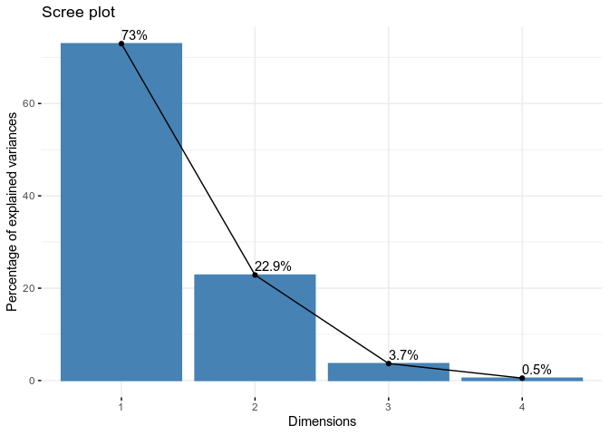
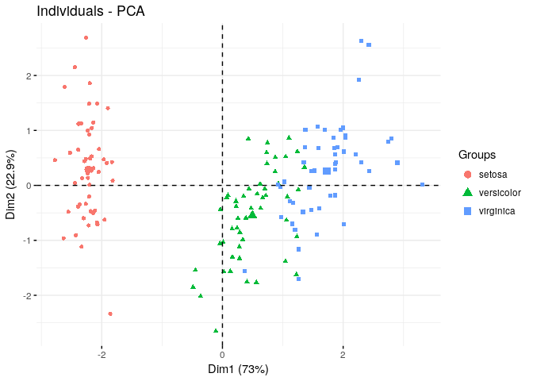
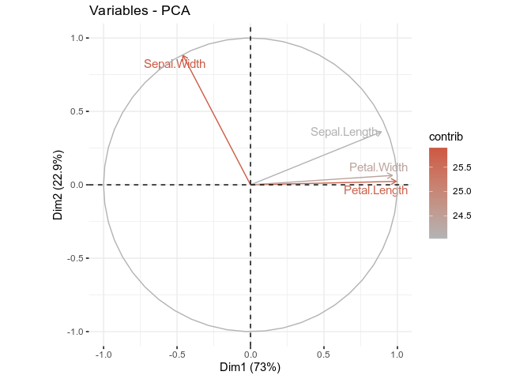
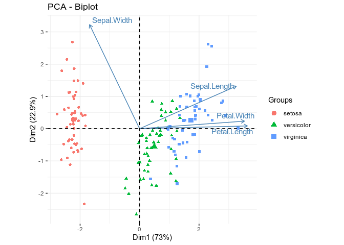
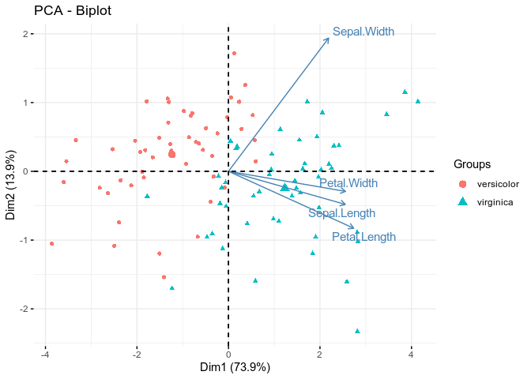

PCA
================
Pietro Franceschi
January 22, 2018

In this second demo we go really multivariate applying PCA to the analysis of some of the dataset we described in the univariate visualization tutorial.

PCA in R can be performed with many different packages, here we will use two of them which are characterized by an optimal tradeoff between flexibility and ease to use. The two packages are `FactoMineR` and `factoextra`. An excellent introduction to their use can be found [there](http://www.sthda.com/english/wiki/factoextra-r-package-easy-multivariate-data-analyses-and-elegant-visualization)

Both packages are not part of the standard R installation. To directly install them just type

``` r
install.packages("FactoMineR")
install.packages("Factoextra")
```

PCA of the Iris Dataset
-----------------------

As before we start with the iris dataset. First of all er load the data and the two R packages

``` r
library(FactoMineR)
library(factoextra)
```

    ## Loading required package: ggplot2

    ## Welcome! Related Books: `Practical Guide To Cluster Analysis in R` at https://goo.gl/13EFCZ

``` r
data(iris)
head(iris)
```

    ##   Sepal.Length Sepal.Width Petal.Length Petal.Width Species
    ## 1          5.1         3.5          1.4         0.2  setosa
    ## 2          4.9         3.0          1.4         0.2  setosa
    ## 3          4.7         3.2          1.3         0.2  setosa
    ## 4          4.6         3.1          1.5         0.2  setosa
    ## 5          5.0         3.6          1.4         0.2  setosa
    ## 6          5.4         3.9          1.7         0.4  setosa

The first step is now to perform the PCA on this dataset, in a sense this application is trivial because we have only four variables. However

``` r
## This code performs the PCA on the unit variance scalde data
irisPCA <- PCA(iris[,1:4],
               scale.unit = TRUE,
               graph = FALSE)
## as usual the summary function returns an informative textual summary of the results
summary(irisPCA)
```

    ## 
    ## Call:
    ## PCA(X = iris[, 1:4], scale.unit = TRUE, graph = FALSE) 
    ## 
    ## 
    ## Eigenvalues
    ##                        Dim.1   Dim.2   Dim.3   Dim.4
    ## Variance               2.918   0.914   0.147   0.021
    ## % of var.             72.962  22.851   3.669   0.518
    ## Cumulative % of var.  72.962  95.813  99.482 100.000
    ## 
    ## Individuals (the 10 first)
    ##                  Dist    Dim.1    ctr   cos2    Dim.2    ctr   cos2  
    ## 1            |  2.319 | -2.265  1.172  0.954 |  0.480  0.168  0.043 |
    ## 2            |  2.202 | -2.081  0.989  0.893 | -0.674  0.331  0.094 |
    ## 3            |  2.389 | -2.364  1.277  0.979 | -0.342  0.085  0.020 |
    ## 4            |  2.378 | -2.299  1.208  0.935 | -0.597  0.260  0.063 |
    ## 5            |  2.476 | -2.390  1.305  0.932 |  0.647  0.305  0.068 |
    ## 6            |  2.555 | -2.076  0.984  0.660 |  1.489  1.617  0.340 |
    ## 7            |  2.468 | -2.444  1.364  0.981 |  0.048  0.002  0.000 |
    ## 8            |  2.246 | -2.233  1.139  0.988 |  0.223  0.036  0.010 |
    ## 9            |  2.592 | -2.335  1.245  0.812 | -1.115  0.907  0.185 |
    ## 10           |  2.249 | -2.184  1.090  0.943 | -0.469  0.160  0.043 |
    ##               Dim.3    ctr   cos2  
    ## 1            -0.128  0.074  0.003 |
    ## 2            -0.235  0.250  0.011 |
    ## 3             0.044  0.009  0.000 |
    ## 4             0.091  0.038  0.001 |
    ## 5             0.016  0.001  0.000 |
    ## 6             0.027  0.003  0.000 |
    ## 7             0.335  0.511  0.018 |
    ## 8            -0.089  0.036  0.002 |
    ## 9             0.145  0.096  0.003 |
    ## 10           -0.254  0.293  0.013 |
    ## 
    ## Variables
    ##                 Dim.1    ctr   cos2    Dim.2    ctr   cos2    Dim.3    ctr
    ## Sepal.Length |  0.890 27.151  0.792 |  0.361 14.244  0.130 | -0.276 51.778
    ## Sepal.Width  | -0.460  7.255  0.212 |  0.883 85.247  0.779 |  0.094  5.972
    ## Petal.Length |  0.992 33.688  0.983 |  0.023  0.060  0.001 |  0.054  2.020
    ## Petal.Width  |  0.965 31.906  0.931 |  0.064  0.448  0.004 |  0.243 40.230
    ##                cos2  
    ## Sepal.Length  0.076 |
    ## Sepal.Width   0.009 |
    ## Petal.Length  0.003 |
    ## Petal.Width   0.059 |

Let's look to some elements of the outputs:

-   The **Call** part shows the PCA call
-   The **Eigenvalues** part is the one showing the characteristics of the PCs. Here we have four PCs, and the first two together account for the 95% of the variance. Looking to the PC1XPC2 plane we expect then to have a quite representative model of the multivariate variance of our data.
-   The **Individuals** speaks about the samples (only the first ten), so it contains the information on the **scores**
-   The **Variables** part shows the weight of the "old" variable in the "new" direction. As an example we see that Petal.Length has a very low "weight" along the second PC (Dim.2). This part of the output describes the **loadings**. For the moment we disregard the other columns

As we discussed, the number of PCs to be considered to reconstruct a reasonably accurate representation of my data can be decided by considering the **screeplot**

``` r
fviz_screeplot(irisPCA, addlabels = TRUE)
```



The graphical output tells us more or less what the text summary was suggesting. Two PCs should give a fair good picture of the data. Let's look to the PCA scoreplot

``` r
fviz_pca_ind(irisPCA, 
             habillage = iris$Species ,  ## use the specie as a color for the display
             label = "none", # hide individual labels
             repel = TRUE # Avoid text overlapping (slow if many points)
             )
```



The plot show the position of the samples on the PC1 X PC2 plane. Each point is a sample. The plot can be further customized. To do that look to the STHDA website mentioned earlier, or to the help of the function `help(fviz_pca_ind)`.

**Observations**

-   The separation between setosas and the other cultivars is bigger
-   Dim1 is sufficient to clearly distinguish the three cultivars
-   ...

The scoreplot gives only "half" of the infos resulting from the PCA, in fact it shows only the position of the individuals. In real life applications, however, we are also interested in the contribution of the old variables to the PCs. This is the content of the loadingsplot

``` r
fviz_pca_var(irisPCA, col.var="contrib",
             gradient.cols = c("gray70", "coral3"),
             repel = TRUE # Avoid text overlapping
             )
```



This plot is also extremely informative. The shade of color highlights the contribution of the four initial variables on PC1 and PC2. Sepal.Width is important for PC2, while the other variables are more influential on PC1. Out of the "horizontal" three, Petal.Length is the one with the strongest weight on PC1. The direction of the arrows also tells that Petal.Width and Petal.Length are highly correlated (pointing on the same direction), while Sepal.Length and Sepal.Width are not correlated.

On this aspect, however, remember that we are here looking only to a projection of the overall space and correlation/non correlation could arise only for projetive reasons.

It is common to integrate the two previous plots into one single visualization called **biplot**

``` r
fviz_pca_biplot(irisPCA, 
                habillage = iris$Species,
                label = "var", # show variable names
                repel = TRUE)
```



This combined visualization allows also to identify the trends of the variables across the samples. The arrows are indeed pointing towards the sample showing an higher value of that specific variable. In our case, for example, Petal.Length is higher in virginica and lower in setosa.

The last point I would like to touch in this demo is dependence of the PCA projection from the data. As discussed during the class, the characteristics of the PCA projection will change if new individuals are added to the dataset. For this reason, it is not always straightforward to compare two different PCAs. In order to show that, let's compare the previous representation with a new one were the initial PCA was performed only on versicolor and virginica.

``` r
irissmall <- iris[iris$Species != "setosa",]

smallPCA <- PCA(irissmall[,1:4],
                scale.unit = TRUE,
                graph = FALSE)
fviz_pca_biplot(smallPCA, 
                habillage = irissmall$Species,
                label = "var", # show variable names
                repel = TRUE)
```



As you can see the representation is slightly different. Could you look to the loadings plot?

Its your turn ...
-----------------

-   Compare the outputs of the PCA analysis of the iris with the biplot of the initial variables. Is the picture coherent?
-   Run a PCA analysis on the wines dataset. There it is also interesting to play with the scaling of the data. Try, for example, to substitute the UV scaling with a log scaling or run PCA without scaling. What do you see
-   Try to run the PCA analysis of the RNAseq data ... is it working?
