Clustering
================
Pietro Franceschi
January 28, 2018

Clustering
==========

On covariance
-------------

Before running into clustering, let's give a look on the meaning of covariance, a graphical representation is, as usual, useful

``` r
## this library is used to create multivariate clusters of normal shape
library(mvtnorm)

## Generate the two classes for the toy dataset
g1 <- rmvnorm(1000, mean = c(3, 3), sigma = matrix(c(1, 0, 0, 2), nrow = 2))
g2 <- rmvnorm(1000, mean = c(3, 3), sigma = matrix(c(1, 1, 1, 2), nrow = 2))

par(mfrow = c(1,2))
plot(g1)
plot(g2)
```

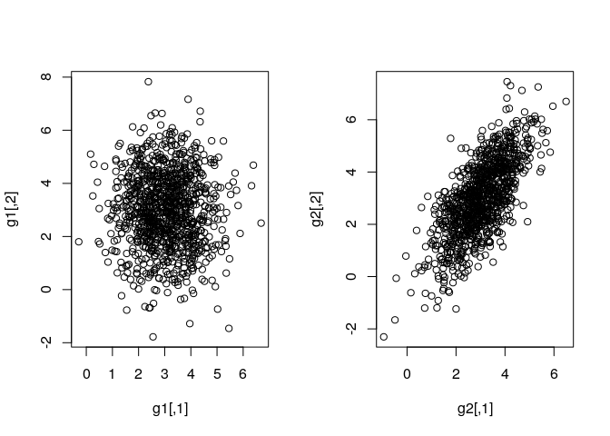

Agglomerative Clustering
------------------------

### The Toy dataset

We start from an easy two class example in two variables. As usual here we have more samples than variables, so the picture will be easier because the space is not really empty.

``` r
## two groups with different covariance shapes ...
g1 <- rmvnorm(20, mean = c(3, 3), sigma = matrix(c(1, 0, 0, 2), nrow = 2))
g2 <- rmvnorm(20, mean = c(8, 8), sigma = matrix(c(1, 1, 1, 2), nrow = 2))

## let's plot the two groups in the 2D plane
toydata <- rbind(g1,g2)
rownames(toydata) <- paste0(rep(1:20, times = 2),rep(c("A","B"),each = 20))
classes <- rep(c(1,2), each = 20)
plot(toydata, pch = classes, col = classes, xlab = "Var 1", ylab = "Var 2")
```

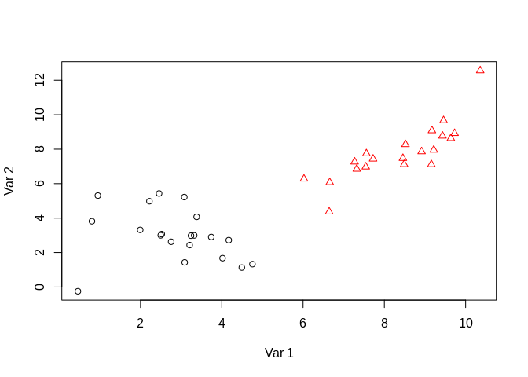

As discussed in the presentation, to perform clustering it is necessary to define a distance measure Let's look to the matrix and is size for the toy dataset

``` r
## calculate the distance matrix between all the elements
toy.dist <- dist(toydata)
summary(toy.dist)
```

    ##    Min. 1st Qu.  Median    Mean 3rd Qu.    Max. 
    ##  0.1282  2.1001  4.0299  4.4670  6.4176 13.4461

``` r
dim(as.matrix(toy.dist))
```

    ## [1] 40 40

``` r
heatmap(as.matrix(toy.dist))
```

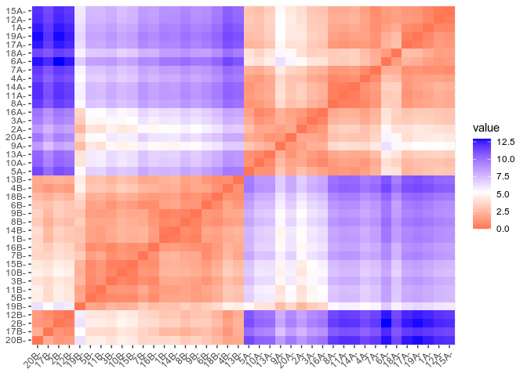

We have clearly two groups, but this is what we expect

``` r
heatmap(as.matrix(dist(toydata, method = "manhattan")))
```

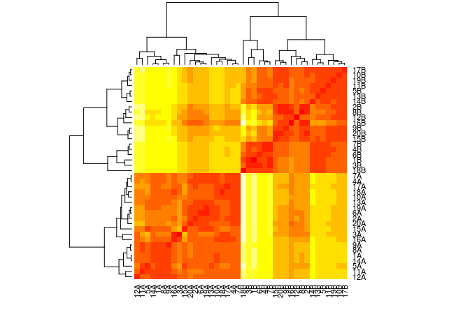

The heatmap is not changing radically, but it is not the same and this demonstrate the importance of a principled choice of the distance (dissimilarity) measure.

Agglomerative clustering in R can be performed without additional packages, the results is a dendrogram

``` r
toy.complete <- hclust(toy.dist)
## plot it
plot(toy.complete, labels = classes)
abline(h = 4, col = "red")
```

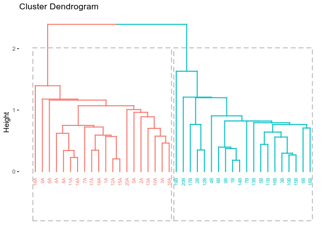

The red horizontal line represent an arbitrary cut, the labels are the classes. As expected, in this easy example, the dendrogram shows two clear groups, which coincide with the initial classes

This is the effect of a change in linkage

``` r
toy.single <- hclust(toy.dist, method = "single")
## plot it
plot(toy.single, labels = classes)
```

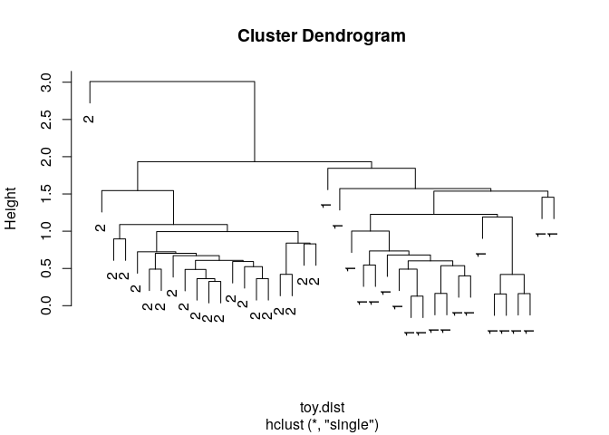

Also in this case the two groups structure is clear, but, another time, remember that this is a really easy case.

The dendrogram can be cut at different levels. In a "segmentation" problem the number is fixed (the question is: "I want to divide my dataset in x groups"), but normally finding the "right" number of clusters is not at all easy. In R the commands useful to process the dendrogram are the following

``` r
## to cut the cluster and get the cluster labels ...
mycut <- cutree(toy.complete, h = 8)

## to get a visual feedback ... 
table(mycut,classes)
```

    ##      classes
    ## mycut  1  2
    ##     1 20  0
    ##     2  0 20

The Iris dataset
----------------

Let's move to the Iris dataset

``` r
data("iris")
```

now we look to the dendrogram obtained by HC

``` r
iris.complete <- hclust(dist(iris[,1:4]))
## plot it
plot(iris.complete, hang = -1, cex = 0.3, labels = iris$Species)
```

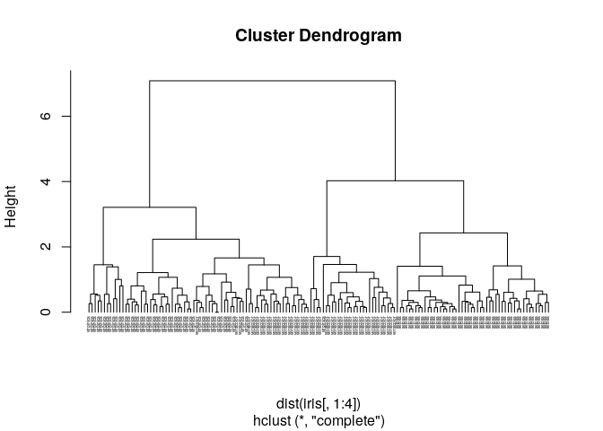

This is clearly not the optimal visualization ... if you want prettier plot please look there [there](http://www.sthda.com/english/wiki/beautiful-dendrogram-visualizations-in-r-5-must-known-methods-unsupervised-machine-learning#plot.dendrogram-function). Beyond aesthetics, we already see that here the situation is less clear than before. How many groups? In addition the scaling of the variables could also make a difference ...

``` r
iris.complete.s <- hclust(dist(scale(iris[,1:4])))
## plot it
plot(iris.complete.s, hang = -1, cex = 0.3, labels = iris$Species)
```

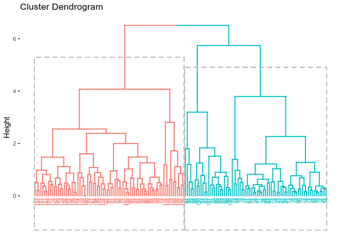

Is this what you expect?

Just to show you, let's make some beautification.

``` r
library(factoextra)
```

    ## Loading required package: ggplot2

    ## Welcome! Related Books: `Practical Guide To Cluster Analysis in R` at https://goo.gl/13EFCZ

``` r
iris.complete.s$labels <- as.character(iris$Species)


fviz_dend(iris.complete.s,
          cex = 0.5,       ## size of the text
          k = 3,           ## three groups
          rect = TRUE, 
          show_labels = TRUE,
          k_colors = c("#1B9E77", "#D95F02", "#7570B3"),      ## colors for the branches
          label_cols =  as.numeric(iris$Species)[iris.complete.s$order])    ## color for the labels
```


**DIY HC assignments**

-   Get the `wines.RData` and cluster the wines.
-   Look how the picture is changing if you tweak the linkage (argument method)
-   look how the picture is changing if you change the scaling of the data.
-   ADVANCED: try to visualize the clusters in the PCA plane ;-)

Partitional Clustering
----------------------

In the case of partitional clustering we will follow the same path. Starting from the toy data, down to the iris data. To visualize some of the results, the `facroextra` can be also used.

The Toy dataset
---------------

As a first step let's use **k-mens** on the toy data, and suppose that we have more than two clusters ...

``` r
## perform k-means ...
toy.km  <- kmeans(toydata, centers = 3)

## non graphical output
table(classes, toy.km$cluster)
```

    ##        
    ## classes  1  2  3
    ##       1  0 20  0
    ##       2  7  0 13

If you run it several times, the result of the clustering is different!!

``` r
## plot the output
plot(toydata, col = toy.km$cluster, pch = classes)
```

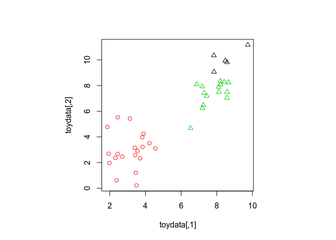

As you can see a third cluster is identified ... but this is not unexpected since we are not asking ourselves which is the optimal number of clusters, but we are only dividing the data in three groups.

-   OK, but how many clusters?
-   ... if I run it several times I'll not always get the same answer ...
-   Do you really have groups? Think, another time, to the "course of dimensionality"

To find the best number of groups a reasonable idea would be to calculate the within group sum of squares. If the number of clusters is optimal this should give a good representation of the samples, so this sum should be minimal.

``` r
wSS <- rep(0,9)
for (i in 1:9){
  pippo  <- kmeans(toydata, centers = i, nstart = 100)
  wSS[i]  <- pippo$tot.withinss
}

plot(seq(1,9), wSS, type = "b")
```

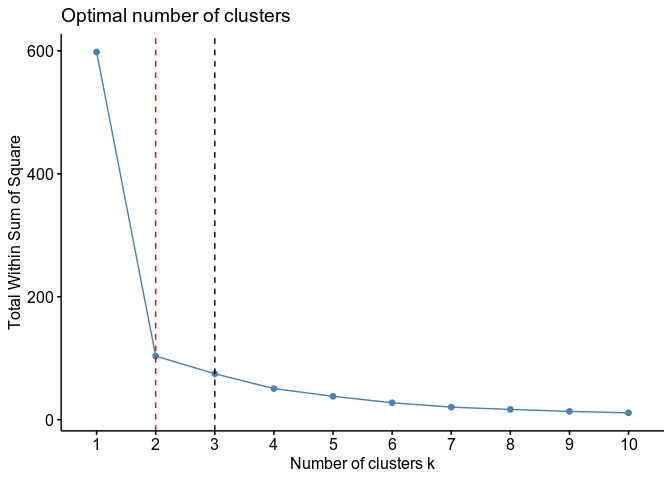

-   The `nstart` argument used before is a way to find the "best" solution for a given number of clusters (we know that different starting points can give different results also for the same number of clusters)
-   The wSS drops from one to two and then it stays almost constant ... this is a good indication of the presence of two clusters, but remember that here we have only two variables ...

The Iris dataset
----------------

``` r
# Data preparation
# +++++++++++++++
data("iris")
head(iris)
```

    ##   Sepal.Length Sepal.Width Petal.Length Petal.Width Species
    ## 1          5.1         3.5          1.4         0.2  setosa
    ## 2          4.9         3.0          1.4         0.2  setosa
    ## 3          4.7         3.2          1.3         0.2  setosa
    ## 4          4.6         3.1          1.5         0.2  setosa
    ## 5          5.0         3.6          1.4         0.2  setosa
    ## 6          5.4         3.9          1.7         0.4  setosa

``` r
iris.scaled <- scale(iris[, -5])
```

This we already know. The results of **k-mens** cannot be visualized in the n dimensional space, but a clever way to look at the output could be to use a PCA to project the data and show the clusters on the top of that

``` r
# K-means clustering
# +++++++++++++++++++++
km.res <- kmeans(iris.scaled, 3, nstart = 50)

# Visualize kmeans clustering
# use repel = TRUE to avoid overplotting
fviz_cluster(km.res, iris[, -5], palette = "Set2", ggtheme = theme_minimal())
```

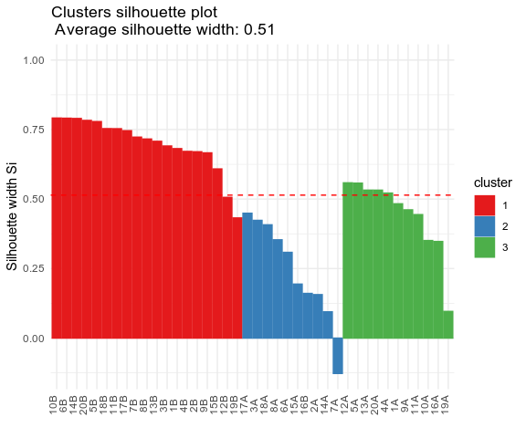

This is nice, but better would be to have the initial labels ... in textual form this can be seen like this

``` r
table(iris$Species,km.res$cluster)
```

    ##             
    ##               1  2  3
    ##   setosa     50  0  0
    ##   versicolor  0 11 39
    ##   virginica   0 36 14

We know how a clusters plot should behave in terms of sum of squares ...

``` r
wSS <- rep(0,9)
for (i in 1:9){
  pippo  <- kmeans(iris.scaled, centers = i, nstart = 100)
  wSS[i]  <- pippo$tot.withinss
}

plot(seq(1,9), wSS, type = "b")
```


As you see here the plot is less informative. It is not easy to decide how many clusters we see. two seems to be the best choice, as the previous plot indicates.

DIY assignments
---------------

-   Get the `wines.RData` and cluster the wines.
-   Try to find the "optimal" number of groups by looking to the wSS
-   look how the picture is changing if you change the scaling of the data.
-   ADVANCED: try to visualize the clusters in the PCA plane. To do that you have to "manually" construct your plot ;-)
