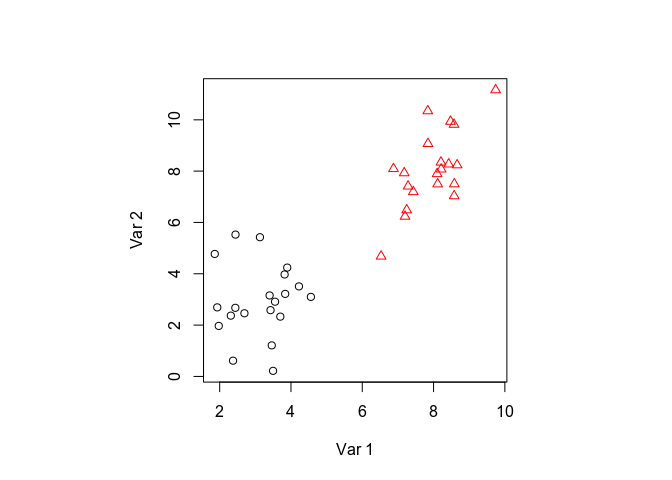
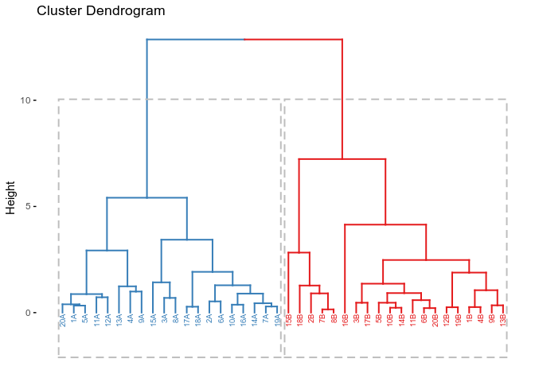
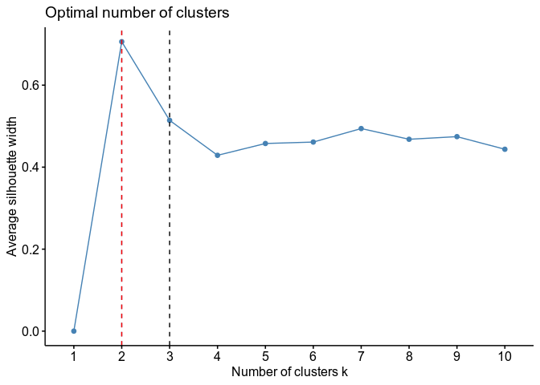
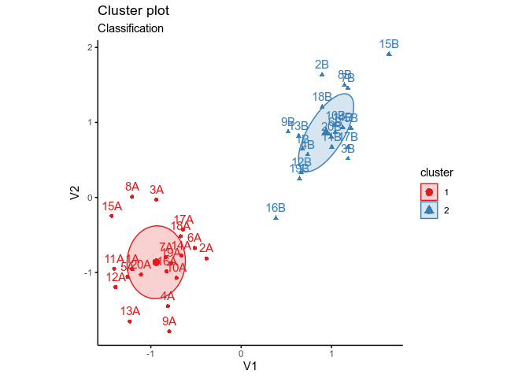
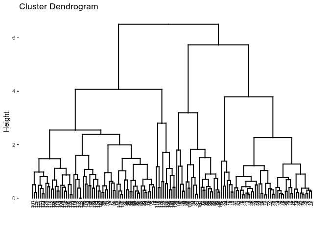
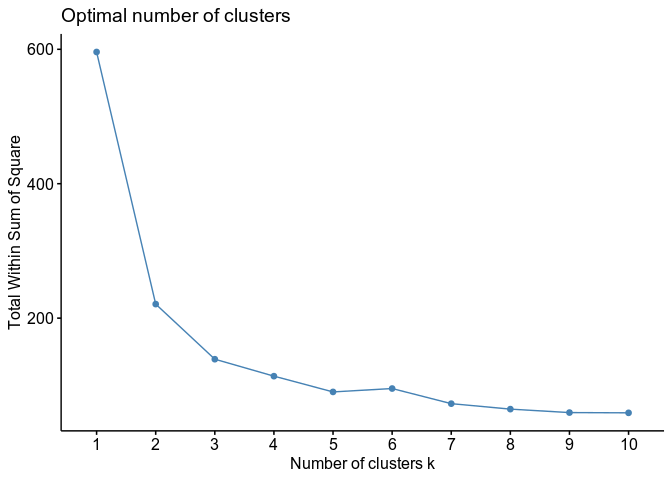
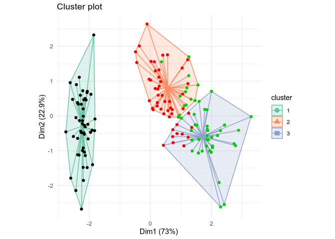
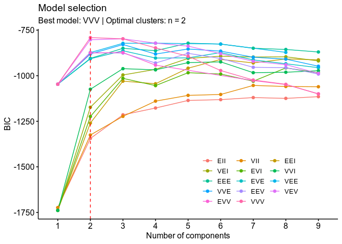
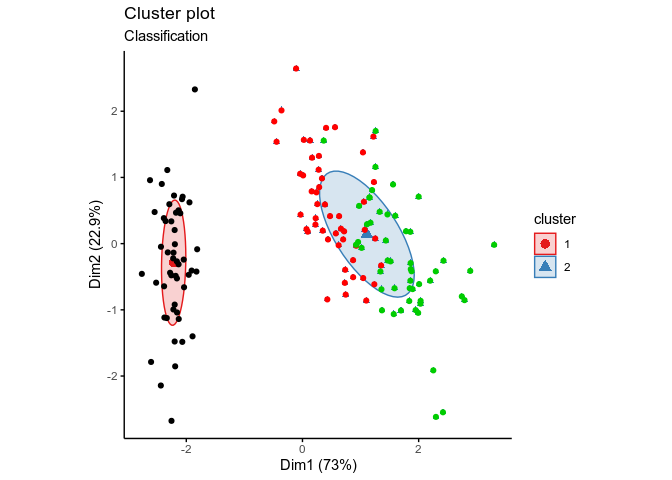
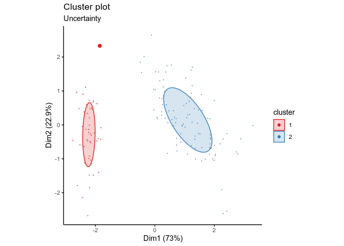

Clustering
================
Pietro Franceschi
June 7, 2020

``` r
library(factoextra)
```

    ## Loading required package: ggplot2

    ## Welcome! Want to learn more? See two factoextra-related books at https://goo.gl/ve3WBa

``` r
library(tidyverse)
```

    ## ── Attaching packages ───────────────────────────────────────────────────────────────────────────────────────────────────────────────────────────────── tidyverse 1.3.0 ──

    ## ✓ tibble  3.0.1     ✓ dplyr   1.0.0
    ## ✓ tidyr   1.1.0     ✓ stringr 1.4.0
    ## ✓ readr   1.3.1     ✓ forcats 0.5.0
    ## ✓ purrr   0.3.4

    ## ── Conflicts ──────────────────────────────────────────────────────────────────────────────────────────────────────────────────────────────────── tidyverse_conflicts() ──
    ## x dplyr::filter() masks stats::filter()
    ## x dplyr::lag()    masks stats::lag()

# Clustering

## On covariance

Before running into clustering, let’s give a look on the meaning of
covariance, a graphical representation is, as usual, useful

``` r
## this library is used to create multivariate clusters of normal shape
library(mvtnorm)

## Generate the two classes for the toy dataset
g1 <- rmvnorm(1000, mean = c(3, 3), sigma = matrix(c(1, 0, 0, 2), nrow = 2))
g2 <- rmvnorm(1000, mean = c(3, 3), sigma = matrix(c(1, 1, 1, 2), nrow = 2))

par(mfrow = c(1,2), pty="s")
plot(g1)
plot(g2)
```

<!-- -->

## Toy Dataset

## Dataset Definition

We start from an easy two class example in two variables. As usual here
we have more samples than variables, so the picture will be easier
because the space is not really empty.

``` r
## two groups with different covariance shapes ...
set.seed(123)
g1 <- rmvnorm(20, mean = c(3, 3), sigma = matrix(c(1, 0, 0, 2), nrow = 2))  
g2 <- rmvnorm(20, mean = c(8, 8), sigma = matrix(c(1, 1, 1, 2), nrow = 2))

## let's plot the two groups in the 2D plane
toydata <- rbind(g1,g2)
rownames(toydata) <- paste0(rep(1:20, times = 2),rep(c("A","B"),each = 20))
classes <- rep(c(1,2), each = 20)
par(pty="s")
plot(toydata, pch = classes, col = classes, xlab = "Var 1", ylab = "Var 2")
```

<!-- -->

As discussed in the presentation, to perform clustering it is necessary
to define a distance measure and to assess the clustering “tendency” of
our data. Here we rely on simple Euclidean distance.

Let’s look to the matrix and is size for the toy
dataset

``` r
## calculate the distance matrix between all the elements (Euclidean metric)
toy.dist <- dist(toydata)
summary(toy.dist)
```

    ##    Min. 1st Qu.  Median    Mean 3rd Qu.    Max. 
    ##   0.152   1.883   4.536   4.659   7.155  12.866

``` r
dim(as.matrix(toy.dist))
```

    ## [1] 40 40

## Assessing clustering tendency

In the lecture we proposed three methods to assess the cluster tendency

  - Data Inspection (trivial here\!)
  - Hopkins statistics
  - Visual method

Let’s start visualizing the distance matrix

``` r
## This is to get a better color dor the matrix!
library(wesanderson)
pal <- wes_palette("Zissou1", 100, type = "continuous")

fviz_dist(toy.dist) + 
  scale_fill_gradientn(colours = pal) + 
  theme(aspect.ratio = 1)
```

    ## Scale for 'fill' is already present. Adding another scale for 'fill', which
    ## will replace the existing scale.

<!-- -->

We have clearly two groups, but this is what we expect\! What’s the
shape of the matrix for a random set of points in the 2d space?

``` r
gr <- cbind(runif(40),runif(40))
toy.dist.rnd <- dist(gr)

fviz_dist(toy.dist.rnd) +
  scale_fill_gradientn(colours = pal) + 
  theme(aspect.ratio = 1)
```

    ## Scale for 'fill' is already present. Adding another scale for 'fill', which
    ## will replace the existing scale.

<!-- -->

## Hopkins Statistics

Hopkins statistics can be calculated with a function also included in
the `factoextra`

``` r
get_clust_tendency(toydata, n = 39, graph = FALSE)
```

    ## $hopkins_stat
    ## [1] 0.7189286
    ## 
    ## $plot
    ## NULL

``` r
get_clust_tendency(gr, n = 39, graph = FALSE)
```

    ## $hopkins_stat
    ## [1] 0.5508529
    ## 
    ## $plot
    ## NULL

A value near 0.5 suggests that the distribution of the data is not
different from a random one, while for the two group case we get an
higher value suggesting the presence of a significant “clustering” of
the data

## Agglomerative Clustering

Agglomerative clustering in R can be performed without additional
packages, the results is a
dendrogram

``` r
## this is the base function which calculates the dendrogram with "complete" linkage
toy.complete <- hclust(toy.dist)

## plot it by using FactoExtra!
fviz_dend(toy.complete,
          cex = 0.5,       ## size of the text
          k = 2,
          rect = TRUE) + scale_color_brewer(palette = "Set1")
```

    ## Scale for 'colour' is already present. Adding another scale for 'colour',
    ## which will replace the existing scale.

<!-- -->

As expected, in this easy example, the dendrogram shows two clear
groups, which coincide with the initial classes.

This is the effect of a change in linkage

``` r
toy.single <- hclust(toy.dist, method = "single")
## plot it
fviz_dend(toy.single,
          cex = 0.5,       ## size of the text
          k = 2,
          rect = TRUE) +
  scale_color_brewer(palette = "Set1")
```

    ## Scale for 'colour' is already present. Adding another scale for 'colour',
    ## which will replace the existing scale.

<!-- -->

Also in this case the two groups structure is clear, but, another time,
remember that this is a really easy case.

The dendrogram can be cut at different levels. In a “segmentation”
problem the number is fixed (the question is: “I want to divide my
dataset in x groups”), but, normally, finding the “right” number of
clusters is not at all easy. In R the commands useful to process the
dendrogram are the following

``` r
## to cut the cluster and get the cluster labels ...
mycut <- cutree(toy.complete, h = 8)

## to get a visual feedback which tells us how well we actually identify the initial classes
table(mycut,classes)
```

    ##      classes
    ## mycut  1  2
    ##     1 20  0
    ##     2  0 20

As discussed in the lecture, if he dendrogram gives a good
representation of the distribution of the points in the space, the
cophenetic distance (the one calculated on the dendrogram) should be
highly correlated with the “overall” distance

``` r
## here we calculate the distance on the dendrogram
res.coph <- cophenetic(toy.complete)

## and we measure its correlation with the "real" distance
cor(toy.dist, res.coph)
```

    ## [1] 0.8694476

Which here is indeed the case.

## Partitional Clustering

In the case of partitional clustering we will follow the same path. As a
first step let’s use **k-mens** on the toy data, and suppose that we
have more than two clusters …

``` r
## perform k-means ...
toy.km  <- kmeans(toydata, centers = 3)

## non graphical output
table(classes, toy.km$cluster)
```

    ##        
    ## classes  1  2  3
    ##       1  0 20  0
    ##       2  5  0 15

Remember that If you run it several times, the result of the clustering
is different\!\!

``` r
## plot the output
par(pty="s")                 ## make the plot square!
plot(toydata, col = toy.km$cluster, pch = classes)
```

<!-- -->

If we look to the data it is clear that the choice of three cluster is
not the optimal trade-off between a good representation of the data
distribution and the number of clusters.

To find the best number of groups a reasonable idea is to calculate the
within group sum of squares. If the number of clusters is optimal this
should give a good representation of the samples, so this sum should be
minimal.

``` r
fviz_nbclust(toydata, kmeans, method = "wss", nstart = 100) + 
  geom_vline(xintercept = 3, linetype = 2) + 
  geom_vline(xintercept = 2, linetype = 2, col = "red")
```

<!-- -->

The WSS drops from one to two and then it stays almost constant … this
is a good indication of the presence of two clusters, but remember that
here we have only two variables …

Another possibility is to use the “Silhouette”

``` r
km.toy <- eclust(toydata, "kmeans", k = 3, nstart = 25, graph = FALSE)
```

``` r
fviz_silhouette(km.toy, print.summary = FALSE) + 
  scale_color_brewer(palette = "Set1") + 
  scale_fill_brewer(palette = "Set1") + 
  theme_minimal() + 
  theme(axis.text.x = element_text(angle = 90, vjust = 0))
```

<!-- -->

The average silhouette gets bigger with two clusters, as expected. This
parameter can be used in place of the WSS

``` r
fviz_nbclust(toydata, kmeans, method = "silhouette", nstart = 100) + 
  geom_vline(xintercept = 3, linetype = 2) + 
  geom_vline(xintercept = 2, linetype = 2, col = "red")
```

<!-- -->

Before moving to a more interesting dataset let’s give a look to the
outcomes of model based clustering

``` r
## library used for model based clustering
library(mclust)
```

This function perform a “search” of the optimal number of clusters and
of the best type of “model” we use to fit the data

``` r
mc <- Mclust(as.data.frame(toydata))
```

and then we visualize …

``` r
fviz_mclust_bic(mc)
```

<!-- -->

This complicated plot shows several things:

  - The different codes specify which type of model you are fitting on
    the data (spherical, ellipsoid, ecc ). See the documentation of
    `mclust` for the details
  - The level of fitting of each model is evaluated in terms of BIC
    (Bayesian Information Criterion)
  - For all models k = 2 is the optimum\! ;-)

<!-- end list -->

``` r
fviz_mclust(mc) + 
  scale_color_brewer(palette = "Set1") + 
  scale_fill_brewer(palette = "Set1") + 
  theme(aspect.ratio = 1)
```

<!-- -->

# The Iris dataset

Let’s move to something less trivial as the Anderson Iris dataset

``` r
data("iris")
```

First of all, do we have evidence that there is a tendency to
clustering?

``` r
## scale the data!
iris.scaled <- scale(iris[, -5])
iris.dist <- dist(iris.scaled)


fviz_dist(iris.dist) + 
  scale_fill_gradientn(colours = pal) + 
  theme(aspect.ratio = 1)
```

<!-- -->

Also in this case the presence of at least two group seems to be clear

In terms of Hopkins statistics

``` r
get_clust_tendency(iris.scaled, n = 120, graph = FALSE)
```

    ## $hopkins_stat
    ## [1] 0.8115405
    ## 
    ## $plot
    ## NULL

the tendency is strongly suggested.

## Hierarchical Clustering

now we look to the dendrogram obtained by HC

``` r
iris.complete <- hclust(iris.dist)
## plot it
fviz_dend(iris.complete,
          cex = 0.5)
```

<!-- -->

Beyond aesthetics, we already see that here the situation is less clear
than in the case of the toy dataset.

In this case we do know the “label” of the different samples so we can
visualize them quite easily. The scientific question will then become:
is the difference between the species visible from the morphometric
measurements?

``` r
iris.complete$labels <- as.character(iris$Species)

fviz_dend(iris.complete,
          cex = 0.3,       ## size of the text
          k = 3,           ## three groups
          rect = TRUE, 
          show_labels = TRUE,
          k_colors = c("#1B9E77", "#D95F02", "#7570B3"),      ## colors for the branches
          label_cols =  as.numeric(iris$Species)[iris.complete$order])    ## color for the labels
```

<!-- -->

The plot looks intriguing:

  - one specie is almost completely separated from the others ( *Setosa*
    )
  - there is a subgroup of *versicolor*
  - *virginica* and *versicolor* are, in general, less well separated

## Partitional clustering

We start performing the search of the “optimal” number of clusters with
k-means

``` r
fviz_nbclust(iris.scaled, kmeans, method = "wss")
```

<!-- -->

The situation here is less clear then before … 2,3 or 4 clusters ?

``` r
km.iris <- kmeans(iris.scaled, 3, nstart = 50)

table(km.iris$cluster,iris$Species)
```

    ##    
    ##     setosa versicolor virginica
    ##   1     50          0         0
    ##   2      0         39        14
    ##   3      0         11        36

This textual output confirm what we have seen … one variety is well
separated from the other two which are mixed-up

Now it would be nice to visualize the outcomes of the clustering, but
here we are dealing with a four dimensional space … A clever strategy
could be to visualize the results of the clustering on a PCA

``` r
# Visualize kmeans clustering
# use repel = TRUE to avoid overplotting
fviz_cluster(km.iris,      ## the outcomes of the clustering
            iris.scaled,  ## the data ued for clustering 
            geom = "point",
            palette = "Set2",
            star.plot = TRUE # Add segments from centroids to items
            ) + 
  geom_point(color = as.numeric(iris$Species)) +     ## This is a trick to color the points according to the initial iris specie
  theme_minimal() + 
  theme(aspect.ratio = 1)
```

<!-- -->

… If you look to what happens with 4 clusters this is extremely
instructive ….

The last thing we want to do here is to use model based clustering to
see if we get similar results …

``` r
mc.iris <- Mclust(iris.scaled)
```

and then we visualize …

``` r
fviz_mclust_bic(mc.iris)
```

<!-- -->

Here there is less consensus among the different type of models, but the
algorithm is automatically selecting two groups …

``` r
fviz_mclust(mc.iris,
            geom = "point") + 
  geom_point(color = as.numeric(iris$Species)) + 
  scale_color_brewer(palette = "Set1") + 
  scale_fill_brewer(palette = "Set1") + 
  theme(aspect.ratio = 1)
```

<!-- -->

This plot shows how much we are sure of the correct classification of
each sample

``` r
fviz_mclust(mc.iris,
            "uncertainty") + 
  scale_color_brewer(palette = "Set1") + 
  scale_fill_brewer(palette = "Set1") + 
  theme(aspect.ratio = 1)
```

<!-- -->

As you can see only one flower seems to be doubtful …
